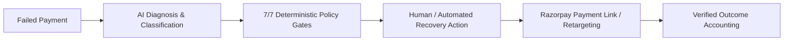

# RazorpayRecoverIQ

> **AI-Assisted, Policy-Bounded Revenue Recovery Command Center for Failed Payments**  
> *Razorpay Buildathon — Track 03: Autonomous Revenue Recovery & Payment Resilience*

---

## 🎯 Executive Product Narrative

When payments fail due to issuer downtime, network timeouts, 3DS authentication drops, or insufficient funds, merchants lose critical revenue. Traditional retry systems either blindly retry (incurring gateway penalty fees and annoying customers) or abandon the recovery completely.

**RazorpayRecoverIQ** bridges this gap with an autonomous, policy-bounded recovery pipeline:



$$\textbf{Failed Payment} \longrightarrow \textbf{AI Understanding} \longrightarrow \textbf{Policy Decision} \longrightarrow \textbf{Bounded Action} \longrightarrow \textbf{Verified Recovered Revenue}$$

---

## 🚀 Key Product Capabilities & Architecture

RecoverIQ is built around five core operational surfaces:

### 1. Executive Command Center (Tab 1)
- **6-KPI Standardized Scorecard**: Revenue at Risk, Recoverable Pipeline, Total Attempts, Gross Recovered, Net Recovered, and Recovery Yield Rate.
- **3-Card Executive Decision Insights**: Immediate High-Yield Actions, Blocked False-Positive Leakage, and Gateway Health Failover alerts.
- **Recovery Economics & Trend Chart**: Visual breakdown of recoverable yield vs. avoided retry fees over time.
- **End-to-End Conversion Funnel**: Ingestion $\to$ Diagnosis $\to$ Policy Clearance $\to$ Execution $\to$ Verification.
- **AI Recovery Copilot & Priority Queue**: Real-time diagnostic guidance and high-value recovery opportunities.

### 2. Opportunities Console & Slide-Over Drawer (Tab 2)
- **Advanced Filtering Suite**: Debounced customer/ID search, multi-select filters for Status, Recovery Action, Confidence, and Amount.
- **Rich Opportunity Table**: Dual-layer confidence meters, customer hierarchy, AI failure archetypes, and sorting/pagination.
- **Fixed Slide-Over Drawer (`OpportunityDrawer`)**:
  - Right-side slide-over panel with backdrop blur, keyboard `Escape` closing, and focus management.
  - Complete financial hierarchy: Failed Amount, Expected Recovery, and Strategy.
  - AI diagnostic reasoning with key decision factors and recovery probabilities.
  - **6-Stage Vertical Workflow Stepper**: `Opportunity Created` $\to$ `AI Recommended` $\to$ `Policy Approved` $\to$ `Payment Link Dispatched` $\to$ `Customer Action` $\to$ `Verified Recovered`.
  - Sticky footer CTA with live execution progress and verified outcome confirmation modal.

### 3. Model Benchmark & Comparative Evaluation (Tab 3)
- **Dual-Audience Validation Hero**: F1 Quality score ring, statistical superiority badge, and gross revenue lift narrative.
- **6-Card Executive Scorecard**: Precision ($TP/(TP+FP)$), Recall ($TP/(TP+FN)$), F1 Score, Classification Accuracy, Passed Test Cases, and Classification Errors.
- **A/B Benchmark Comparison Matrix**: RecoverIQ AI Policy vs. Naive Baseline across precision, yield, gross revenue, and avoided fees.
- **Authentic 2x2 Diagnostic Confusion Matrix**: Actual ground truth vs. Predicted classifications with case percentages and fee economics.
- **Sample Test Cases Drill-Down**: Inspectable holdout test cases table with filter tabs (*All*, *Classification Errors*, *Passed*).

### 4. Platform Reliability & Cryptographic Security (Tab 4)
- **Platform Trust Summary**: 4 state-driven cards for Reliability (Fail-Safe), Security (HMAC-SHA256), Data Integrity (Idempotency Ledger), and Auditability (7/7 Policy Gates).
- **Operational Infrastructure Health**: 4 subsystem health cards (Razorpay Test Gateway, HMAC Webhook Gateway, AI ML Engine, Policy Safety Engine).
- **2-Column Interactive Resilience Console**: Live probe execution suite for signature tampering, duplicate webhooks, AI timeouts, and API disruptions with live transition telemetry.
- **7-Control Security Matrix**: Enforced authentication, authorization, HMAC integrity, deduplication, audit logging, and data validation.
- **Progressive Disclosure**: Collapsible local ngrok tunneling guide and live cryptographic audit trail.

### 5. Production Readiness & Release Assessment (Tab 5)
- **Credible Release Gate Hero**: Communicates honest compliance ($10/10$ mandatory gates passed) and clear release recommendation (`READY FOR CONTROLLED PILOT`).
- **6-Dimension Category Scorecards**: Functionality, Reliability & Failover, Security, Observability & Audit, Data Integrity, and Recovery Safety.
- **Release Blockers & Deficiencies Alerting**: Surfaces any required actions before general production sign-off.
- **Progressive Telemetry Disclosure**: Collapsible JSON evidence for every verified production gate.

---

## 🏗️ System Architecture & Codebase Map

```
RazorpayRecoverIQ/
├── backend/
│   ├── app/
│   │   ├── main.py                    # FastAPI application, middleware, lifecycle
│   │   ├── api/routes.py              # REST API endpoints (Command Center, Opportunities, Evaluation, Readiness)
│   │   ├── webhooks.py                # HMAC-SHA256 signature verification & deduplication
│   │   ├── recovery_intelligence.py   # AI diagnosis & local heuristic fallback engine
│   │   ├── policy_engine.py           # 7/7 deterministic safety guardrails
│   │   ├── recovery_executor.py       # Payment link creation & recovery adapter dispatch
│   │   ├── outcome_verifier.py        # Verified outcome accounting & state transitions
│   │   ├── evaluation.py              # Synthetic holdout benchmarking & confusion matrix math
│   │   ├── demo_seed.py               # Deterministic demo scenarios & test cases
│   │   ├── db.py                      # Database models, schemas, and event store
│   │   └── gateway_adapters.py        # Razorpay Test & Simulation adapters
│   ├── tests/                         # Comprehensive pytest suite
│   └── requirements.txt               # Backend Python dependencies
├── frontend/
│   ├── src/
│   │   ├── App.tsx                    # Main application orchestrator & tab routing
│   │   ├── app.css                    # Production Global Design System & responsive styles
│   │   ├── types/index.ts             # Strict TypeScript data contracts
│   │   ├── services/api.ts            # Typed Axios API client
│   │   ├── utils/formatters.ts        # Currency (INR), percentage, and timestamp formatters
│   │   └── components/
│   │       ├── commandCenter/         # Tab 1: KPIs, charts, funnel, copilot, queue
│   │       ├── opportunities/         # Tab 2: Table, filters, Slide-over Drawer
│   │       ├── evaluation/            # Tab 3: Hero, 6-scorecard, benchmark, 2x2 matrix
│   │       ├── reliability/           # Tab 4: Trust summary, health, resilience console, controls
│   │       ├── readiness/             # Tab 5: Release hero, 6-scorecard, gate checklist
│   │       ├── layout/                # Header, navigation bar, demo action controls
│   │       └── common/                # Badges, modals, skeletons, error banners
│   ├── package.json                   # Frontend dependencies
│   └── vite.config.ts                 # Vite bundler configuration
├── start.sh                           # One-command macOS/Linux startup script
├── start.ps1                          # One-command Windows PowerShell startup script
└── README.md                          # Project documentation
```

---

## ⚡ Quick Start & Running Locally

### Prerequisites
- **Python 3.10+**
- **Node.js 18+** and **npm**

### One-Command Startup

#### Linux / macOS:
```bash
chmod +x ./start.sh
./start.sh
```

#### Windows (PowerShell):
```powershell
.\start.ps1
```

Default Local URLs:
- **Frontend Command Center**: [http://127.0.0.1:5173](http://127.0.0.1:5173)
- **Backend API & Swagger Docs**: [http://127.0.0.1:8000/docs](http://127.0.0.1:8000/docs)
- **Backend Health Endpoint**: [http://127.0.0.1:8000/api/v1/health](http://127.0.0.1:8000/api/v1/health)

---

## 🛠️ Configuration & Environment Variables

Copy `.env.example` to `.env`:

```env
APP_NAME=RazorpayRecoverIQ
APP_ENV=development
APP_MODE=simulation
RECOVERIQ_DB_URL=sqlite:///./recoveriq.db
API_PREFIX=/api/v1

# Razorpay Sandbox Credentials (for live testing)
RAZORPAY_KEY_ID=rzp_test_your_key_id
RAZORPAY_KEY_SECRET=your_key_secret
RAZORPAY_WEBHOOK_SECRET=your_webhook_secret
PAYMENT_ADAPTER_MODE=razorpay_test

# AI Provider Settings
AI_PROVIDER=mock
OLLAMA_MODEL=llama3

# Logging
LOG_LEVEL=INFO
LOG_SQL_QUERIES=false
```

---

## 🌐 Live Webhook Tunneling (Razorpay Sandbox Setup)

To ingest live payment failure callbacks from the Razorpay Sandbox Dashboard:

1. **Launch a public tunnel**:
   ```bash
   ngrok http 8000
   ```
2. **Register Webhook in Razorpay Dashboard**:
   - URL: `https://<your-tunnel-id>.ngrok-free.app/api/v1/webhooks/razorpay`
   - Active Events: `payment.failed`, `payment.captured`, `payment_link.paid`
   - Secret: Matches `RAZORPAY_WEBHOOK_SECRET` in `.env`.
3. **Verify**: Trigger a test card decline on Razorpay Checkout. RecoverIQ will authenticate the HMAC-SHA256 signature, deduplicate the event, create an opportunity, and display it in the Command Center.

---

## 🧪 Testing & Verification Suite

### Frontend Build & Type Check:
```bash
cd frontend
npm run build
```
*(Ensures zero TypeScript errors and generates an optimized production bundle).*

### Backend Pytest Suite:
```bash
python -m pytest backend/tests -v
```

---

## 🔒 Security & Deterministic Reliability Guarantees

1. **Cryptographic Webhook Verification**: Raw payload byte stream computed with HMAC-SHA256 against `X-Razorpay-Signature`. Any tampered payload is rejected with `HTTP 401 Unauthorized`.
2. **Zero-State Idempotency Ledger**: Webhook event IDs are hashed and checked against the database ledger to ensure zero duplicate recovery charges.
3. **7/7 Deterministic Safety Guardrails**: Hard policy limits gate every action:
   - Minimum AI confidence threshold ($\ge 0.65$)
   - Maximum recovery attempt limits ($\le 3$)
   - Maximum transaction amount limits
   - Expected net positive yield verification
   - Merchant whitelist authorization
   - Duplicate active link prevention
   - Sandbox / Production mode safety gates
4. **Autonomous AI Fallback**: If external LLMs encounter network timeouts or schema errors, a local deterministic heuristic engine seamlessly assumes diagnosis without dropping recovery flows.

---

## 👥 Contributors & Buildathon Track
- **Project**: RazorpayRecoverIQ
- **Track**: Track 03 — Autonomous Revenue Recovery & Payment Resilience
- **Built for**: Razorpay Buildathon
