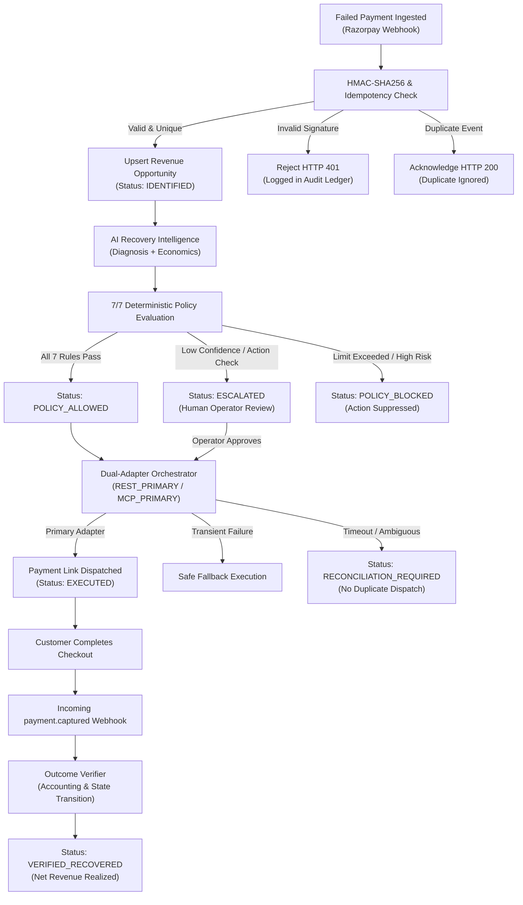
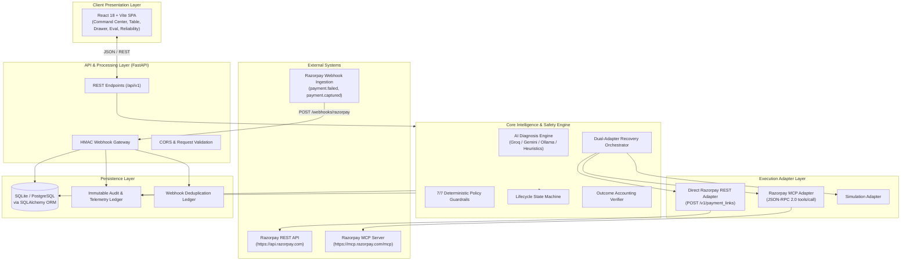

# RecoverIQ — Revenue Recovery Command Center

> **Autonomous, Policy-Bounded Revenue Recovery Engine for Failed Razorpay Payments**  
> *Built for Razorpay Buildathon — Track 03: Autonomous Revenue Recovery & Payment Resilience*

[](https://fastapi.tiangolo.com)
[](https://react.dev)
[](https://vitejs.dev)
[](https://razorpay.com/docs/)
[-8A2BE2)](https://modelcontextprotocol.io/)
[](LICENSE)

---

## Executive Overview

Payment failures are the silent killer of digital commerce. When checkout attempts drop due to transient issuer outages, 3DS authentication timeouts, network glitches, or temporary fund shortages, merchants suffer immediate customer churn and irrecoverable revenue leakage. Traditional recovery systems rely either on blind programmatic retries—which burn merchant gateway fees and risk customer-facing duplicate charges—or manual follow-ups that arrive days too late.

**RecoverIQ** bridges this gap with an autonomous, policy-bounded revenue recovery command center. Combining **AI diagnostic intelligence** with **7 deterministic safety policy gates**, a **Dual-Adapter Execution Engine (Razorpay Direct REST + Razorpay Model Context Protocol / MCP)**, and **safe timeout reconciliation**, RecoverIQ evaluates every payment failure in real time, recommends the optimal intervention pathway, enforces mathematical safety guardrails, dispatches Razorpay recovery instruments, and cryptographically verifies captured outcomes.

$$\textbf{Failed Payment} \longrightarrow \textbf{AI Diagnosis} \longrightarrow \textbf{7/7 Policy Gates} \longrightarrow \textbf{Dual Adapter (REST / MCP)} \longrightarrow \textbf{HMAC Verification} \longrightarrow \textbf{Audit Ledger}$$

---

## 1. The Problem

In high-volume digital business, payment failures create three severe operational liabilities:

1. **Recoverable Revenue Leakage**: Up to 40% of payment failures stem from recoverable issues (e.g., intermittent bank network timeouts, expired 3DS sessions, or transient debit decline) rather than permanent fraud or insolvency.
2. **Blind Retry Penalties & Customer Friction**: Naive cron-based retries trigger issuer debit-frequency alarms, incur merchant gateway penalty surcharges, and risk charging the customer twice.
3. **Operational Opacity**: Finance and engineering teams lack a unified command center connecting failure telemetry, recovery decisions, safety guardrails, and verified accounting.

---

## 2. The Solution

RecoverIQ re-engineers payment recovery around an inviolable architectural boundary:

> **AI determines recovery opportunity. Deterministic policy gates control whether an action is executed. Dual-adapter execution guarantees resilient delivery without duplicate mutations.**

```
┌──────────────────────────────────────┐     ┌──────────────────────────────────────┐
│       AI Intelligence Engine         │     │     Deterministic Policy Guardrails   │
│  • Failure classification & reason   │ ──► │  • 7/7 Zero-Trust safety gates       │
│  • Recovery probability (0–100%)     │     │  • Hard exposure limits (≤ ₹9,000)   │
│  • Confidence score (0–100%)         │     │  • Zero-duplicate active links       │
│  • Expected net recovery economics   │     │  • Maximum attempt caps (≤ 3 tries)  │
└──────────────────────────────────────┘     └──────────────────────────────────────┘
                                                                │
                                              ALLOW / ESCALATE / BLOCK
                                                                │
                                                                ▼
                                             ┌──────────────────────────────────────┐
                                             │     Dual-Adapter Execution Engine    │
                                             │  ├── Direct Razorpay REST Adapter    │
                                             │  └── Razorpay MCP Adapter (JSON-RPC) │
                                             │  • Safe Timeout Reconciliation Guard │
                                             │  • HMAC-SHA256 Webhook Accounting    │
                                             └──────────────────────────────────────┘
```

By decoupling probabilistic machine reasoning from execution safety, RecoverIQ ensures that no AI hallucination, edge-case failure, or statistical error can ever trigger an unauthorized transaction, double-charge a user, or violate merchant financial policy.

---

## 3. Why RecoverIQ

| Capability | What It Delivers in RecoverIQ |
| :--- | :--- |
| **Revenue Recovery Command Center** | Real-time executive cockpit displaying Revenue at Risk, Recoverable Pipeline, Gross Recovered, Net Recovered, and Net Recovery Yield Rate. |
| **Priority Recovery Queue** | Algorithmic ranking of failed opportunities prioritized by yield potential, customer lifetime value, and urgency. |
| **Multi-Provider AI Diagnosis** | Categorizes failure archetypes (`NETWORK`, `ISSUER_DECLINED`, `INSUFFICIENT_FUNDS`, `3DS_FAILED`) with support for Groq, Gemini, Ollama, and Deterministic Heuristics. |
| **Recovery Economics Engine** | Calculates expected gross yield against estimated gateway intervention costs to guarantee net-positive recovery. |
| **7/7 Deterministic Safety Gates** | Independent code rules that evaluate amount caps, confidence floors, attempt limits, duplicate status, and environment constraints. |
| **Dual REST ↔ MCP Execution** | Flexible execution strategies (`REST_PRIMARY`, `MCP_PRIMARY`, `REST_ONLY`, `MCP_ONLY`) with automatic, safe failover between Direct REST and Razorpay MCP. |
| **Ambiguous Outcome Reconciliation** | In-flight timeout guard preventing secondary adapter executions until provider state is verified, neutralizing double-charging risk. |
| **Razorpay Payment Link Recovery** | Automated dispatch via Razorpay API (`/v1/payment_links`) and Razorpay MCP tool (`create_payment_link`) with unique reference tracking. |
| **HMAC-SHA256 Webhook Gateway** | Constant-time cryptographic verification on `X-Razorpay-Signature` against raw byte streams to neutralize replay and tampering attacks. |
| **Zero-State Idempotency Ledger** | Content-hashed event storage preventing duplicate processing of retried or delayed webhook deliveries. |
| **Slide-Over Opportunity Drawer** | Deep-dive workspace featuring financial breakdowns, diagnostic evidence, execution strategy badges, a 6-stage workflow stepper, and manual execution triggers. |
| **Evaluation & Benchmark Suite** | Live A/B holdout comparison measuring Precision, Recall, F1, False-Positive Rate, and economic lift with mathematical consistency. |
| **2-Column Resilience Console** | Live failure injection suite simulating signature tampering, duplicate webhooks, LLM timeouts, and API disruptions. |
| **10-Gate Production Readiness** | Automated compliance validation checking security, reliability, data integrity, and recovery governance. |

---

## 4. The Core Workflow

Every payment failure progresses through an audited lifecycle state machine:



---

## 5. System Architecture

RecoverIQ is built as a lightweight, high-performance decoupled system:



---

## 6. AI + Safety Model & Policy Guardrails

The core technical innovation of RecoverIQ is the explicit separation between **AI reasoning** and **execution authorization**.

### The 7 Deterministic Safety Guardrails

| # | Guardrail Name | Rule Definition | Failure Behavior |
| :-: | :--- | :--- | :--- |
| **1** | `test_mode` | Mode must be `simulation`, `test`, or `development`. Protects production environments from unintended mock test calls. | `BLOCK` |
| **2** | `max_amount` | Amount at risk must be $\le \text{₹}9,000$ (`900_000` minor units). Prevents high-exposure automated execution. | `BLOCK` |
| **3** | `confidence` | AI confidence score must be $\ge 60\%$. Prevents low-confidence AI guesses from executing. | `ESCALATE` |
| **4** | `expected_net` | Expected net recovery must be $\ge \text{₹}0.01$ (`1` minor unit). Guarantees merchant profitability after intervention costs. | `BLOCK` |
| **5** | `retry_limit` | Total recovery attempts on opportunity must be $< 3$. Protects customers from harassment. | `BLOCK` |
| **6** | `duplicate` | Zero currently active attempts in `REQUESTED`, `EXECUTED`, or `PENDING_VERIFICATION`. | `BLOCK` |
| **7** | `allowlisted_action` | Action must be `CREATE_PAYMENT_LINK`. Prevents unauthorized or unmapped operations. | `ESCALATE` |

---

## 7. Dual Razorpay Execution: REST & MCP

RecoverIQ supports both traditional Direct REST API execution and the Model Context Protocol (MCP) standard:

### 1. Direct Razorpay REST Adapter
- **Endpoint**: `https://api.razorpay.com/v1/payment_links`
- **Auth**: HTTP Basic Auth (`rzp_test_...`)
- **Payload**: Standard Razorpay Payment Link schema with idempotency headers.

### 2. Razorpay Model Context Protocol (MCP) Adapter
- **Transport**: JSON-RPC 2.0 over HTTP POST (`"jsonrpc": "2.0"`, `"method": "tools/call"`)
- **Endpoint**: `https://mcp.razorpay.com/mcp` (or local MCP server)
- **Tool**: `create_payment_link` with standardized arguments (`amount`, `currency`, `reference_id`, `description`, `notes`).
- **Discovery**: Dynamic tool discovery via JSON-RPC 2.0 `tools/list`.

### 3. Safe Execution Strategies & Failover
- **`REST_PRIMARY`**: Attempts Direct REST first; falls back to MCP on transient gateway errors.
- **`MCP_PRIMARY`**: Attempts Razorpay MCP tool first; falls back to Direct REST on transient errors.
- **`REST_ONLY` / `MCP_ONLY`**: Dedicated single-adapter modes.
- **Safe Timeout Reconciliation**: If an adapter times out after sending a creation payload, the system records `RECONCILIATION_REQUIRED` and blocks alternative adapter calls until state is verified, preventing double-charging consumers.

---

## 8. Key Product Modules

### Command Center (Tab 1)
- **Executive Metric Scorecards**: 6 primary KPIs tracking Total Attempts, Revenue at Risk, Recoverable Pipeline, Gross Recovered, Avoided Fees, and Net Recovered.
- **Header Status Indicators**: Compact badges displaying `Razorpay Test Mode`, `HMAC Verified`, `Policy Active`, and `MCP Available / Active`.
- **Conversion Funnel**: Step-by-step visual tracker showing attrition from Ingestion to Final Verified Recovery.

### Opportunities Console & Drawer (Tab 2)
- **Fintech Data Table**: Clean, tabular view of failed payment incidents with customer name, exposure amount, expected yield, AI diagnostic archetype, confidence score, and action state.
- **Slide-Over Opportunity Drawer**:
  - Activated by clicking any row or pressing `Enter`.
  - Displays customer historical recovery profile, AI reasoning quote, and execution strategy (`REST_PRIMARY` / `MCP_PRIMARY`).
  - **6-Stage Vertical Workflow Stepper** showing real-time progression.
  - Manual execution CTA with instant confirmation feedback.

### Evaluation Module (Tab 3)
- **Model Benchmark Scorecards**: Tracks Precision, Recall, F1 Score, Classification Accuracy, Passed Test Cases, and Classification Errors.
- **Authentic 2x2 Confusion Matrix**: Classifies True Positives, False Positives, False Negatives, and True Negatives with attached financial economics.
- **Holdout Test Cases**: Interactive table of test cases with filters for *Passed*, *Errors*, and *All*.

### Reliability & Security Architecture (Tab 4)
- **Platform Trust Summary**: State-driven overview of Fail-Safe Reliability, HMAC Security, Idempotency Integrity, and 7/7 Policy Enforcement.
- **Subsystem Health Cards**: Real-time status of Razorpay Gateway, Webhook Ingestion, AI Intelligence Engine, Policy Engine, and MCP Integration.
- **2-Column Resilience Console**: Interactive failure injection harness allowing operators to simulate signature tampering, duplicate webhooks, LLM timeouts, and API disruptions.

### Production Readiness Assessment (Tab 5)
- **Release Gate Hero**: Displays honest release posture (`READY FOR CONTROLLED PILOT`).
- **6-Dimension Scorecards**: Functionality, Reliability & Failover, Security, Observability & Audit, Data Integrity, and Recovery Safety.
- **Checklist Audit**: Inspectable list of all 10 release gates with collapsible JSON evidence.

---

## 9. Quickstart & Installation

### Prerequisites
- **Python 3.10+** (or Conda environment e.g. `conda activate razor-env`)
- **Node.js 18+** and **npm**

### One-Command Startup (Recommended)

#### macOS / Linux:
```bash
chmod +x ./start.sh
./start.sh
```

#### Windows (PowerShell):
```powershell
.\start.ps1
```

The script automatically:
1. Installs frontend dependencies (`npm install`) if missing.
2. Frees ports `8000` and `5173` if occupied by stale processes.
3. Launches the FastAPI backend on `http://127.0.0.1:8000`.
4. Launches the Vite frontend on `http://127.0.0.1:5173`.

### Access URLs
- **Frontend Application**: [http://127.0.0.1:5173](http://127.0.0.1:5173)
- **Interactive Swagger API Docs**: [http://127.0.0.1:8000/docs](http://127.0.0.1:8000/docs)
- **Backend Health Check**: [http://127.0.0.1:8000/api/v1/health](http://127.0.0.1:8000/api/v1/health)

---

## 10. Environment Variables

All configuration is managed through Pydantic Settings:

| Variable | Purpose | Default | Example |
| :--- | :--- | :---: | :--- |
| `APP_MODE` | Runtime operational mode (`simulation` or `test`) | `simulation` | `test` |
| `RECOVERIQ_DB_URL` | SQLAlchemy database connection URI | `sqlite:///./recoveriq.db` | `sqlite:///./recoveriq.db` |
| `RAZORPAY_KEY_ID` | Razorpay Test Key ID (must begin with `rzp_test_`) | `""` | `rzp_test_TXXvh4uHNMGCt4` |
| `RAZORPAY_KEY_SECRET` | Razorpay Test Key Secret | `""` | `kEa5bjj1PKzWaPoN9dWc1lYb` |
| `RAZORPAY_WEBHOOK_SECRET` | Secret for HMAC-SHA256 signature verification | `""` | `RazorpayRecoverIQ_Test_2026` |
| `PAYMENT_ADAPTER_MODE` | Strategy (`simulation`, `razorpay_test`, `mcp_primary`, `rest_primary`) | `simulation` | `razorpay_test` |
| `RAZORPAY_MCP_ENABLED` | Enable Razorpay MCP integration | `false` | `true` |
| `RAZORPAY_MCP_ENDPOINT`| Razorpay MCP JSON-RPC 2.0 endpoint URL | `https://mcp.razorpay.com/mcp` | `https://mcp.razorpay.com/mcp` |
| `AI_PROVIDER` | Diagnostic provider (`mock`, `groq`, `gemini`, `ollama`) | `mock` | `groq` |
| `GROQ_API_KEY` | API key when using Groq LLM | `""` | `gsk_...` |
| `GEMINI_API_KEY` | API key when using Gemini AI | `""` | `AQ....` |

> [!IMPORTANT]
> Live Razorpay credentials (`rzp_live_*`) are **hard-blocked** by internal safety assertions (`PaymentAdapterConfigurationError`) to prevent accidental live charges.

---

## 11. Testing & Verification

RecoverIQ includes a comprehensive automated test suite with **27 test files and 156 test cases** completing in under 10 seconds:

```bash
# Run complete backend test suite (FastAPI + Pytest)
python -m pytest backend/tests -v

# Run frontend TypeScript type-check and production build
npm --prefix frontend run build
```

---

## 👥 Contributors & Buildathon Track

- **Project**: RecoverIQ
- **Event**: Razorpay Buildathon
- **Track**: Track 03 — Autonomous Revenue Recovery & Payment Resilience
- **License**: MIT

---

## 19. Limitations & Demo Scope

To maintain complete transparency:
- **Simulation / Test Mode**: All payment link generation and webhook handling operate in Razorpay Test Mode or local deterministic simulation. No real customer cards are charged.
- **Holdout Dataset**: The Evaluation benchmark is computed against a standardized synthetic test dataset modeling high-frequency failure archetypes.
- **Single-Merchant Scope**: The current implementation models a single merchant account (`acc_demo_seed`); multi-tenant merchant isolation is architected for future releases.

---

## 20. Testing & Verification

Run the automated test suite to verify system integrity:

```bash
# Backend Test Suite (FastAPI + Pytest)
python -m pytest backend/tests -v

# Frontend TypeScript & Build Verification
cd frontend
npm run build
```

---

## 👥 Contributors & Buildathon Track

- **Project**: RecoverIQ
- **Event**: Razorpay Buildathon
- **Track**: Track 03 — Autonomous Revenue Recovery & Payment Resilience
- **License**: MIT
