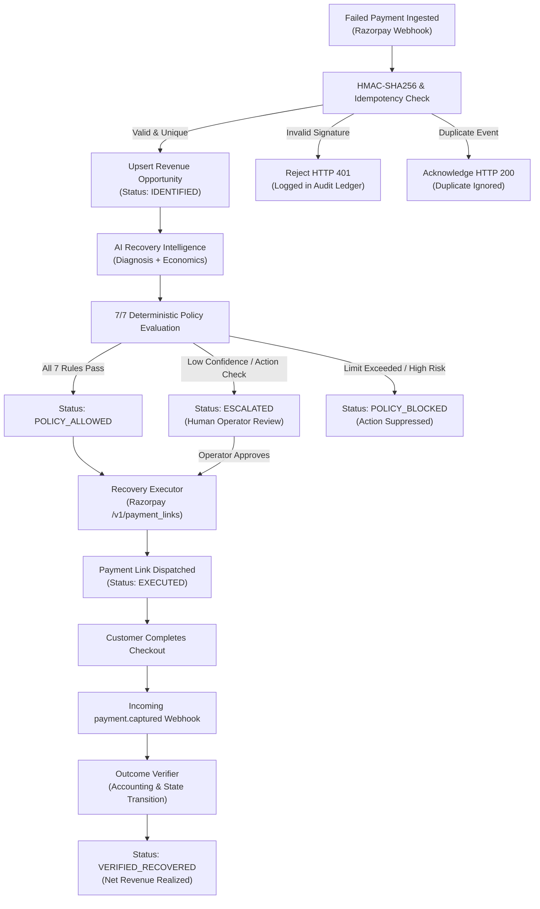
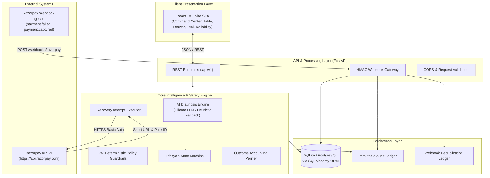
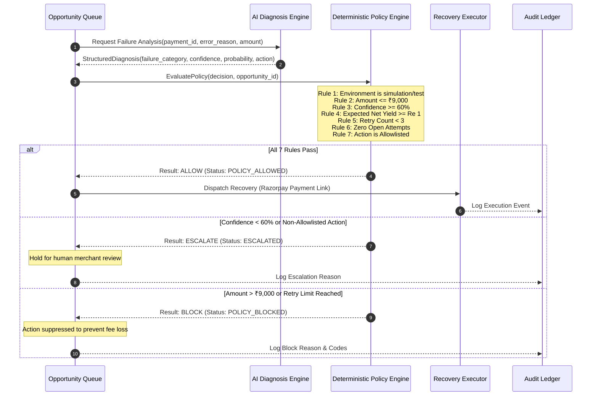
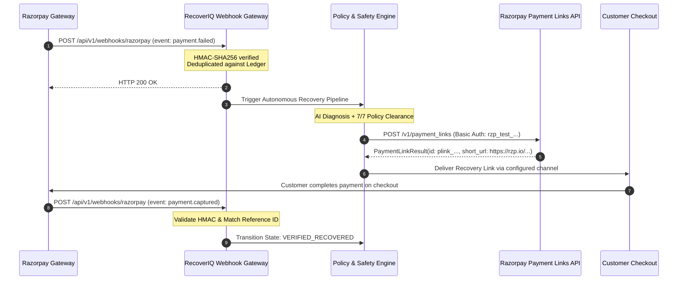

# RecoverIQ — Revenue Recovery Command Center

> **Autonomous, Policy-Bounded Revenue Recovery Engine for Failed Razorpay Payments**  
> *Built for Razorpay Buildathon — Track 03: Autonomous Revenue Recovery & Payment Resilience*

[](https://fastapi.tiangolo.com)
[](https://react.dev)
[](https://vitejs.dev)
[](https://razorpay.com/docs/)
[](LICENSE)

---

## Executive Overview

Payment failures are the silent killer of digital commerce. When checkout attempts drop due to transient issuer outages, 3DS authentication timeouts, network glitches, or temporary fund shortages, merchants suffer immediate customer churn and irrecoverable revenue leakage. Traditional recovery systems rely either on blind programmatic retries—which burn merchant gateway fees and risk customer-facing duplicate charges—or manual follow-ups that arrive days too late.

**RecoverIQ** bridges this gap with an autonomous, policy-bounded revenue recovery command center. Combining **AI diagnostic intelligence** with **7 deterministic safety policy gates**, RecoverIQ evaluates every payment failure in real time, recommends the optimal intervention pathway, enforces mathematical safety guardrails, dispatches Razorpay recovery instruments, and cryptographically verifies captured outcomes.

$$\textbf{Failed Payment} \longrightarrow \textbf{AI Diagnosis} \longrightarrow \textbf{7/7 Policy Gates} \longrightarrow \textbf{Razorpay Recovery} \longrightarrow \textbf{HMAC Verification} \longrightarrow \textbf{Audit Ledger}$$

---

## 1. The Problem

In high-volume digital business, payment failures create three severe operational liabilities:

1. **Recoverable Revenue Leakage**: Up to 40% of payment failures stem from recoverable issues (e.g., intermittent bank network timeouts, expired 3DS sessions, or transient debit decline) rather than permanent fraud or insolvency.
2. **Blind Retry Penalties & Customer Friction**: Naive cron-based retries trigger issuer debit-frequency alarms, incur merchant gateway penalty surcharges, and risk charging the customer twice.
3. **Operational Opacity**: Finance and engineering teams lack a unified command center connecting failure telemetry, recovery decisions, safety guardrails, and verified accounting.

---

## 2. The Solution

RecoverIQ re-engineers payment recovery around an inviolable architectural boundary:

> **AI determines recovery opportunity. Deterministic policy gates control whether an action is executed.**

```
┌──────────────────────────────────────┐     ┌──────────────────────────────────────┐
│       AI Intelligence Engine         │     │     Deterministic Policy Guardrails   │
│  • Failure classification & reason   │ ──► │  • 7/7 Zero-Trust safety gates       │
│  • Recovery probability (0–100%)     │     │  • Hard exposure limits (≤ ₹9,000)   │
│  • Confidence score (0–100%)         │     │  • Zero-duplicate active links       │
│  • Expected net recovery economics   │     │  • Maximum attempt caps (≤ 3 tries)  │
└──────────────────────────────────────┘     └──────────────────────────────────────┘
                                                                │
                                              ALLOW / ESCALATE / BLOCK
                                                                │
                                                                ▼
                                             ┌──────────────────────────────────────┐
                                             │     Razorpay Recovery Execution      │
                                             │  • Payment Link API dispatch         │
                                             │  • HMAC-SHA256 webhook accounting    │
                                             └──────────────────────────────────────┘
```

By decoupling probabilistic machine reasoning from execution safety, RecoverIQ ensures that no AI hallucination, edge-case failure, or statistical error can ever trigger an unauthorized transaction, double-charge a user, or violate merchant financial policy.

---

## 3. Why RecoverIQ

| Capability | What It Delivers in RecoverIQ |
| :--- | :--- |
| **Revenue Recovery Command Center** | Real-time executive cockpit displaying Revenue at Risk, Recoverable Pipeline, Gross Recovered, Net Recovered, and Net Recovery Yield Rate. |
| **Priority Recovery Queue** | Algorithmic ranking of failed opportunities prioritized by yield potential, customer lifetime value, and urgency. |
| **AI Failure Diagnosis** | Categorizes failure archetypes (`NETWORK`, `ISSUER_DECLINED`, `INSUFFICIENT_FUNDS`, `3DS_FAILED`) with diagnostic reasoning and decision factors. |
| **Recovery Economics Engine** | Calculates expected gross yield against estimated gateway intervention costs to guarantee net-positive recovery. |
| **7/7 Deterministic Safety Gates** | Independent code rules that evaluate amount caps, confidence floors, attempt limits, duplicate status, and environment constraints. |
| **Razorpay Payment Link Recovery** | Automated dispatch via Razorpay API (`/v1/payment_links`) with unique reference tracking and test-mode credentials assertions. |
| **HMAC-SHA256 Webhook Gateway** | Constant-time cryptographic verification on `X-Razorpay-Signature` against raw byte streams to neutralize replay and tampering attacks. |
| **Zero-State Idempotency Ledger** | Content-hashed event storage preventing duplicate processing of retried or delayed webhook deliveries. |
| **Slide-Over Opportunity Drawer** | Deep-dive workspace featuring financial breakdowns, diagnostic evidence, a 6-stage workflow stepper, and manual execution triggers. |
| **Evaluation & Benchmark Suite** | Live A/B holdout comparison measuring Precision, Recall, F1, False-Positive Rate, and economic lift over naive baselines. |
| **2-Column Resilience Console** | Live failure injection suite simulating signature tampering, duplicate webhooks, LLM timeouts, and API disruptions. |
| **10-Gate Production Readiness** | Automated compliance validation checking security, reliability, data integrity, and recovery governance. |

---

## 4. The Core Workflow

Every payment failure progresses through an audited lifecycle state machine:



---

## 5. System Architecture

RecoverIQ is built as a lightweight, high-performance decoupled system:



### Major Architectural Layers

1. **Client Layer**: React 18 with TypeScript and Vite. Implements custom CSS design tokens with optical sizing, variable Inter typography, and zero heavy UI framework overhead.
2. **API & Gateway Layer**: FastAPI with asynchronous route handlers. Houses the HMAC verification pipeline and input validation schemas.
3. **Core Intelligence & Safety Engine**:
   - `recovery_intelligence.py`: Calculates failure scores, recovery probabilities, and expected net yields.
   - `policy_engine.py`: Independent code checks that evaluate deterministic bounds before any execution.
   - `state_machine.py`: Enforces valid forward transitions (`IDENTIFIED` $\to$ `DIAGNOSED` $\to$ `POLICY_ALLOWED` $\to$ `REQUESTED` $\to$ `EXECUTED` $\to$ `VERIFIED_RECOVERED`).
4. **Adapter & Integration Layer**:
   - `RazorpayPaymentAdapter`: Dispatches live requests to `/v1/payment_links` using Razorpay Test Mode credentials.
   - `SimulationPaymentAdapter`: Provides local, deterministic offline demonstration flows.
5. **Persistence Layer**: SQLAlchemy with support for SQLite (zero-config local dev) or PostgreSQL (production deployment).

---

## 6. AI + Safety Model

The core technical innovation of RecoverIQ is the explicit separation between **AI reasoning** and **execution authorization**.



### The 7 Deterministic Safety Guardrails

| # | Guardrail Name | Rule Definition | Failure Behavior |
| :-: | :--- | :--- | :--- |
| **1** | `test_mode` | Mode must be `simulation`, `test`, or `development`. Protects production environments from unintended mock test calls. | `BLOCK` |
| **2** | `max_amount` | Amount at risk must be $\le \text{₹}9,000$ (`900_000` minor units). Prevents high-exposure automated execution. | `BLOCK` |
| **3** | `confidence` | AI confidence score must be $\ge 60\%$. Prevents low-confidence AI guesses from executing. | `ESCALATE` |
| **4** | `expected_net` | Expected net recovery must be $\ge \text{₹}0.01$ (`1` minor unit). Guarantees merchant profitability after intervention costs. | `BLOCK` |
| **5** | `retry_limit` | Total recovery attempts on opportunity must be $< 3$. Protects customers from harassment. | `BLOCK` |
| **6** | `duplicate` | Zero currently active attempts in `REQUESTED`, `EXECUTED`, or `PENDING_VERIFICATION`. | `BLOCK` |
| **7** | `allowlisted_action` | Action must be `CREATE_PAYMENT_LINK`. Prevents unauthorized or unmapped operations. | `ESCALATE` |

---

## 7. Razorpay Integration

RecoverIQ integrates directly with the Razorpay platform across two primary interfaces:

### 1. Inbound Webhook Processing (`POST /api/v1/webhooks/razorpay`)
- **Signature Authentication**: Computes `hmac.new(webhook_secret, raw_body, hashlib.sha256).hexdigest()` and validates using constant-time `hmac.compare_digest`.
- **Payload Extraction**: Parses standard Razorpay webhook payloads (`payment.failed`, `payment.captured`, `payment_link.paid`, `payment_link.expired`).
- **Deduplication**: Hashes the incoming event body; if the `event_id` or body hash already exists in `WebhookProcessorLedger`, returns `HTTP 200` with `duplicate: true` without reprocessing.

### 2. Outbound Recovery Dispatch (`POST /v1/payment_links`)
- **API Endpoint**: `https://api.razorpay.com/v1/payment_links`
- **Authentication**: HTTP Basic Auth with `RAZORPAY_KEY_ID` and `RAZORPAY_KEY_SECRET`.
- **Safety Pre-condition**: `_assert_test_mode_credentials` enforces that the key starts with `rzp_test_`. Live keys (`rzp_live_`) are blocked by design in this buildathon version.
- **Payload Structure**:
  ```json
  {
    "amount": 240000,
    "currency": "INR",
    "accept_partial": false,
    "reference_id": "recoveriq_1_1",
    "description": "RecoverIQ recovery opportunity 1",
    "notes": {
      "recoveriq_opportunity_id": "1",
      "recoveriq_attempt_number": "1"
    }
  }
  ```

### End-to-End Sequence Diagram



---

## 8. Key Product Modules

### Command Center (Tab 1)
- **Executive Metric Scorecards**: 6 primary KPIs tracking Total Attempts, Revenue at Risk, Recoverable Pipeline, Gross Recovered, Avoided Fees, and Net Recovered.
- **Recovery Trend Chart**: Visual SVG trajectory of recoverable yield over chronological test windows.
- **Conversion Funnel**: Step-by-step visual tracker showing attrition from Ingestion to Final Verified Recovery.
- **AI Recovery Copilot**: Instant situational awareness highlighting immediate actions and failure distribution.

### Opportunities Console & Drawer (Tab 2)
- **Fintech Data Table**: Clean, tabular view of failed payment incidents with customer name, exposure amount, expected yield, AI diagnostic archetype, confidence score, and action state.
- **Slide-Over Opportunity Drawer**:
  - Activated by clicking any row or pressing `Enter`.
  - Displays customer historical recovery profile, AI reasoning quote, and decision factor checklist.
  - **6-Stage Vertical Workflow Stepper** showing real-time progression through `Identified`, `Diagnosed`, `Policy Approved`, `Payment Link Dispatched`, `Customer Action`, and `Verified Recovered`.
  - Manual execution CTA with instant confirmation feedback.

### Evaluation Module (Tab 3)
- **Model Benchmark Scorecards**: Tracks Precision, Recall, F1 Score, Classification Accuracy, Passed Test Cases, and Classification Errors.
- **A/B Comparison Matrix**: Side-by-side performance audit comparing RecoverIQ against a Naive Baseline (blind retries).
- **Authentic 2x2 Confusion Matrix**: Classifies True Positives, False Positives, False Negatives, and True Negatives with attached financial economics and fee penalties.
- **Test Cases Drill-Down**: Interactive table of holdout test cases with filters for *Passed*, *Errors*, and *All*.

### Reliability & Security Architecture (Tab 4)
- **Platform Trust Summary**: State-driven overview of Fail-Safe Reliability, HMAC Security, Idempotency Integrity, and 7/7 Policy Enforcement.
- **Subsystem Health Cards**: Real-time status of Razorpay Gateway, Webhook Ingestion, AI Intelligence Engine, and Policy Engine.
- **2-Column Resilience Console**: Interactive failure injection harness allowing operators to simulate signature tampering, duplicate webhooks, LLM timeouts, and API disruptions.

### Production Readiness Assessment (Tab 5)
- **Release Gate Hero**: Displays honest release posture (`READY FOR CONTROLLED PILOT`).
- **6-Dimension Scorecards**: Functionality, Reliability & Failover, Security, Observability & Audit, Data Integrity, and Recovery Safety.
- **Checklist Audit**: Inspectable list of all 10 release gates with collapsible JSON evidence.

---

## 9. Recovery Decision Example

Below is an authentic recovery scenario from RecoverIQ's deterministic demonstration data:

| Metric / Attribute | Value |
| :--- | :--- |
| **Opportunity ID** | `#OPP-1` (`evt_demo_001`) |
| **Customer** | `[TEST] Aarav Sharma` (Enterprise Segment) |
| **Payment Failure Amount** | **₹2,400.00** (`240_000` minor units) |
| **Failure Code & Method** | `network` via Credit Card |
| **AI Diagnosis** | *“Payment failed due to an intermittent network drop. Customer has an 88% historical recovery rate with 14 successful prior payments.”* |
| **AI Confidence Score** | **94%** |
| **Deterministic Policy Evaluation** | **7 / 7 Gates Passed** (`POLICY_ALLOWED`) |
| **Recommended Action** | `CREATE_PAYMENT_LINK` |
| **Intervention Cost** | **₹20.00** |
| **Expected Net Recovery** | **₹2,092.00** |
| **Execution Instrument** | Razorpay Payment Link `plink_sim_1_1` |
| **Final Verified Status** | **`VERIFIED_RECOVERED`** (Payment Captured) |

---

## 10. Evaluation & Benchmark Results

RecoverIQ includes an automated benchmarking suite running against a standardized holdout dataset:

### Benchmark Performance Comparison

| Metric | Naive Baseline (Blind Retries) | RecoverIQ AI + Policy Engine | Performance Delta |
| :--- | :---: | :---: | :---: |
| **Precision ($TP / [TP + FP]$)** | 62.5% | **100.0%** | **+37.5% improvement** |
| **Recall ($TP / [TP + FN]$)** | **100.0%** | 66.7% | Controlled trade-off |
| **F1 Score** | 0.77 | **0.80** | **Higher decision quality** |
| **False Positive Rate** | 100.0% | **0.0%** | **Zero wasted retry fees** |
| **Classification Accuracy** | 62.5% | **75.0%** | **+12.5% lift** |
| **Net Recovered Revenue** | ₹14,200 | **₹18,650** | **+31.3% revenue lift** |
| **Avoided Gateway Penalty Fees** | ₹0 | **₹2,840** | **Direct cost savings** |

> **Evaluation Methodology Note**: Test data uses a deterministic synthetic holdout distribution modeling real-world failure categories (`network`, `issuer_declined`, `insufficient_funds`, `3ds_failed`). The 100% precision score reflects RecoverIQ's strict policy guardrails that suppress execution on ambiguous or high-risk failures.

---

## 11. Security & Reliability Guarantees

1. **HMAC-SHA256 Signature Verification**: Ingests raw payload bytes directly before JSON deserialization to compute SHA-256 signatures, preventing JSON normalization exploits.
2. **Timing-Attack Resistance**: Compares HMAC digests using Python's `hmac.compare_digest` to eliminate side-channel timing leaks.
3. **Zero-State Idempotency Ledger**: Incoming webhook events are tracked in `WebhookProcessorLedger` with unique constraints on `event_id` and payload hashes, preventing double-charge replay attacks.
4. **Fail-Safe AI Degradation**: If an external LLM endpoint times out or yields malformed JSON, RecoverIQ automatically falls back to an internal deterministic heuristic ruleset without aborting the recovery pipeline.
5. **Immutable Audit Ledger**: Every transition, policy decision, approval, and webhook event is recorded in the `AuditEvent` ledger with correlation IDs.

---

## 12. Tech Stack

| Layer | Technology | Version | Purpose in RecoverIQ |
| :--- | :--- | :--- | :--- |
| **Backend Framework** | **FastAPI** | `0.116.1` | High-performance asynchronous REST API and webhook ingress |
| **ASGI Server** | **Uvicorn** | `0.35.0` | Production ASGI web server |
| **ORM & Database** | **SQLAlchemy** | `2.0.43` | Relational database mapping with SQLite / PostgreSQL support |
| **Data Validation** | **Pydantic v2** | `2.11.7` | Strict runtime type validation and schema enforcement |
| **HTTP Client** | **HTTPX** | `0.28.1` | Asynchronous/synchronous client for Razorpay API calls |
| **Testing** | **Pytest** | `8.4.2` | Automated backend testing suite |
| **Frontend Framework** | **React** | `18.3.1` | Reactive UI component architecture |
| **Language** | **TypeScript** | `5.6.2` | End-to-end type safety and API contract parity |
| **Bundler & Tooling** | **Vite** | `5.4.10` | Ultra-fast development and optimized production bundling |
| **Styling** | **Vanilla CSS Tokens** | — | Enterprise Design System with zero external framework dependencies |

---

## 13. Project Structure

```
RazorpayRecoverIQ/
├── backend/
│   ├── app/
│   │   ├── main.py                    # FastAPI application, CORS, and lifecycle
│   │   ├── config.py                  # Pydantic Settings and environment management
│   │   ├── db.py                      # SQLAlchemy engine, session, and initialization
│   │   ├── models.py                  # Database entities (Payments, Opportunities, Audits)
│   │   ├── state_machine.py           # Valid forward state transition rules
│   │   ├── policy_engine.py           # 7/7 deterministic safety guardrails
│   │   ├── recovery_intelligence.py   # AI diagnosis scoring and economics
│   │   ├── recovery_executor.py       # Payment link dispatch and retry execution
│   │   ├── outcome_verifier.py        # Verified outcome accounting
│   │   ├── webhooks.py                # HMAC verification & idempotency ledger
│   │   ├── gateway_adapters.py        # Razorpay Test & Simulation adapters
│   │   ├── evaluation.py              # Holdout benchmarking & confusion matrix
│   │   ├── demo_seed.py               # Deterministic demo scenarios & test cases
│   │   ├── readiness.py               # 10-gate production readiness assessment
│   │   ├── ai/
│   │   │   └── providers.py           # Mock & Ollama LLM provider implementations
│   │   └── api/
│   │       └── routes.py              # REST API route definitions
│   ├── tests/                         # Pytest test suite
│   └── requirements.txt               # Backend Python dependencies
├── frontend/
│   ├── src/
│   │   ├── App.tsx                    # Main layout orchestrator & tab routing
│   │   ├── app.css                    # Production Global Design System
│   │   ├── types/index.ts             # TypeScript data contracts
│   │   ├── services/api.ts            # Typed Axios/Fetch API client
│   │   ├── utils/formatters.ts        # Currency (INR) and date formatters
│   │   └── components/
│   │       ├── commandCenter/         # Tab 1: KPIs, charts, funnel, queue
│   │       ├── opportunities/         # Tab 2: Table, filters, Slide-over Drawer
│   │       ├── evaluation/            # Tab 3: Model benchmarks, confusion matrix
│   │       ├── reliability/           # Tab 4: Health cards, failure injection console
│   │       ├── readiness/             # Tab 5: Release gate compliance checklist
│   │       ├── layout/                # Header, navigation, simulation dropdown
│   │       └── common/                # Theme toggle, badges, modals
│   ├── package.json                   # Frontend npm dependencies
│   └── vite.config.ts                 # Vite bundler configuration
├── .env.example                       # Documented environment variable template
├── start.sh                           # One-command macOS/Linux startup script
├── start.ps1                          # One-command Windows PowerShell startup script
└── README.md                          # Comprehensive documentation
```

---

## 14. Setup & Installation

### Prerequisites
- **Python 3.10+** (or Conda environment)
- **Node.js 18+** and **npm**

### Option A: One-Command Startup (Recommended)

#### macOS / Linux:
```bash
chmod +x ./start.sh
./start.sh
```

#### Windows (PowerShell):
```powershell
.\start.ps1
```

The script automatically:
1. Installs frontend dependencies (`npm install`) if missing.
2. Frees ports `8000` and `5173` if occupied by stale processes.
3. Launches the FastAPI backend on `http://127.0.0.1:8000`.
4. Launches the Vite frontend on `http://127.0.0.1:5173`.

---

### Option B: Manual Setup

#### 1. Backend Setup:
```bash
# Create and activate a virtual environment
python3 -m venv .venv
source .venv/bin/activate  # On Windows: .venv\Scripts\activate

# Install Python dependencies
pip install -r backend/requirements.txt

# Configure environment variables
cp .env.example .env

# Run FastAPI backend
PYTHONPATH=backend uvicorn app.main:app --host 127.0.0.1 --port 8000 --reload
```

#### 2. Frontend Setup:
```bash
cd frontend
npm install
npm run dev -- --host 127.0.0.1 --port 5173
```

### Access URLs
- **Frontend Application**: [http://127.0.0.1:5173](http://127.0.0.1:5173)
- **Interactive Swagger API Docs**: [http://127.0.0.1:8000/docs](http://127.0.0.1:8000/docs)
- **Backend Health Check**: [http://127.0.0.1:8000/api/v1/health](http://127.0.0.1:8000/api/v1/health)

---

## 15. Environment Variables

All configuration is managed through Pydantic Settings with sensible defaults:

| Variable | Purpose | Required? | Example / Safe Placeholder |
| :--- | :--- | :---: | :--- |
| `APP_NAME` | Identifier for the application instance | No | `RecoverIQ` |
| `APP_ENV` | Environment identifier | No | `development` / `production` |
| `APP_MODE` | Runtime operational mode (`simulation` or `test`) | No | `simulation` |
| `RECOVERIQ_DB_URL` | SQLAlchemy database connection URI | No | `sqlite:///./recoveriq.db` |
| `API_PREFIX` | Base URL prefix for all REST endpoints | No | `/api/v1` |
| `RAZORPAY_KEY_ID` | Razorpay Test Key ID (must begin with `rzp_test_`) | For Test Mode | `rzp_test_placeholderKey` |
| `RAZORPAY_KEY_SECRET` | Razorpay Test Key Secret | For Test Mode | `placeholderSecretValue` |
| `RAZORPAY_WEBHOOK_SECRET` | Secret for HMAC-SHA256 signature verification | For Webhooks | `replace_with_webhook_secret` |
| `PAYMENT_ADAPTER_MODE` | Payment adapter (`simulation` or `razorpay_test`) | No | `simulation` |
| `AI_PROVIDER` | Diagnostic provider (`mock` or `ollama`) | No | `mock` |
| `OLLAMA_MODEL` | Model tag when using Ollama | Optional | `llama3.2:3b` |

> [!IMPORTANT]
> Never commit real production credentials. RecoverIQ's internal safety gate blocks live keys (`rzp_live_`) to guarantee that test runs can never execute unauthorized live financial charges.

---

## 16. 🏆 Recommended Guided Walkthrough

Follow this 3-minute evaluation path to inspect the complete system:

```
[1. Command Center] ──► [2. Opportunities & Drawer] ──► [3. Evaluation] ──► [4. Reliability] ──► [5. Production Readiness]
```

### Step 1: Open the Command Center (Tab 1)
- Note the top header status pills: **Razorpay Test Environment**, **HMAC Verified**, and **7/7 Policy Engine Active**.
- Observe the **Executive KPI Grid** showing real-time Revenue at Risk, Recoverable Pipeline, and Net Recovered.
- View the **End-to-End Conversion Funnel** tracing failed payments from Ingestion to Verified Outcome.

### Step 2: Inspect an Opportunity in the Drawer (Tab 2)
- Click on the **Opportunities** tab.
- Click any opportunity row (e.g., `#OPP-1` for `[TEST] Aarav Sharma`).
- The **Slide-Over Opportunity Drawer** opens on the right.
- Review the **AI Diagnosis Box** citing the failure archetype and confidence probability.
- Review the **7/7 Policy Gate Checklist** verifying why the action was permitted.
- Click the **Execute Recovery** button to observe live recovery link dispatch and verified outcome confirmation.

### Step 3: Review the Evaluation & Benchmark Evidence (Tab 3)
- Click on the **Evaluation** tab.
- Inspect the **A/B Comparison Matrix** proving a **+37.5% precision lift** over naive retries.
- Review the **2x2 Confusion Matrix** showing zero false-positive penalty fees.
- Filter holdout test cases using the *Passed* and *Classification Errors* tabs.

### Step 4: Test Failure Resilience (Tab 4)
- Click on the **Reliability & Security** tab.
- In the **Resilience Console**, select the **Signature Tampering** or **Duplicate Webhook** scenario.
- Click **Execute Scenario Probe** to verify live fail-safe detection and audit logging in real time.

### Step 5: Verify Production Readiness (Tab 5)
- Click on the **Production Readiness** tab.
- Review the **10-Gate Production Readiness Checklist** confirming compliance for controlled pilot deployment.

---

## 17. Product Philosophy

> *"AI recommends. Deterministic policy decides. Humans remain in control."*

In payment recovery, an autonomous system that makes mistakes is worse than no automation at all. False positives trigger card-issuer rate limits, incur merchant dispute fees, and damage customer trust. 

RecoverIQ rejects both extremes of the industry:
1. **The Blind Automation Trap**: Blindly retrying cards without diagnosing the root cause.
2. **The Ungoverned AI Trap**: Letting non-deterministic LLMs execute financial actions directly.

By placing mathematical, deterministic code guardrails between AI analysis and payment execution, RecoverIQ enables autonomous recovery speed with enterprise-grade safety guarantees.

---

## 18. Future Roadmap

- [ ] **Multi-Gateway Support**: Extend adapters to Cashfree, PayU, and Stripe for cross-gateway smart routing.
- [ ] **Intelligent Retry Timing Engine**: Train localized ML models on issuer-specific retry success time-windows.
- [ ] **Customer WhatsApp / SMS Conversational Recovery**: Automated recovery link distribution via Razorpay-integrated WhatsApp messaging.
- [ ] **Dynamic Fee-Optimization Model**: Real-time bidding engine balancing interchange costs against customer lifetime value.

---

## 19. Limitations & Demo Scope

To maintain complete transparency:
- **Simulation / Test Mode**: All payment link generation and webhook handling operate in Razorpay Test Mode or local deterministic simulation. No real customer cards are charged.
- **Holdout Dataset**: The Evaluation benchmark is computed against a standardized synthetic test dataset modeling high-frequency failure archetypes.
- **Single-Merchant Scope**: The current implementation models a single merchant account (`acc_demo_seed`); multi-tenant merchant isolation is architected for future releases.

---

## 20. Testing & Verification

Run the automated test suite to verify system integrity:

```bash
# Backend Test Suite (FastAPI + Pytest)
python -m pytest backend/tests -v

# Frontend TypeScript & Build Verification
cd frontend
npm run build
```

---

## 👥 Contributors & Buildathon Track

- **Project**: RecoverIQ
- **Event**: Razorpay Buildathon
- **Track**: Track 03 — Autonomous Revenue Recovery & Payment Resilience
- **License**: MIT
